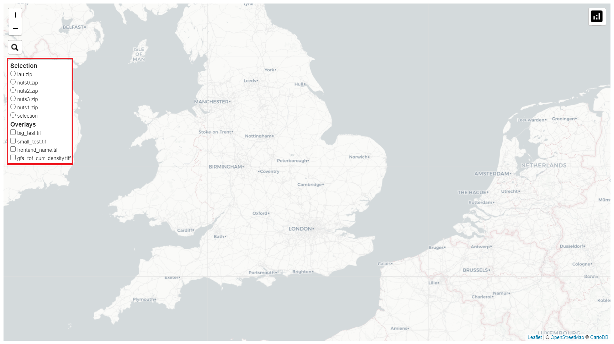
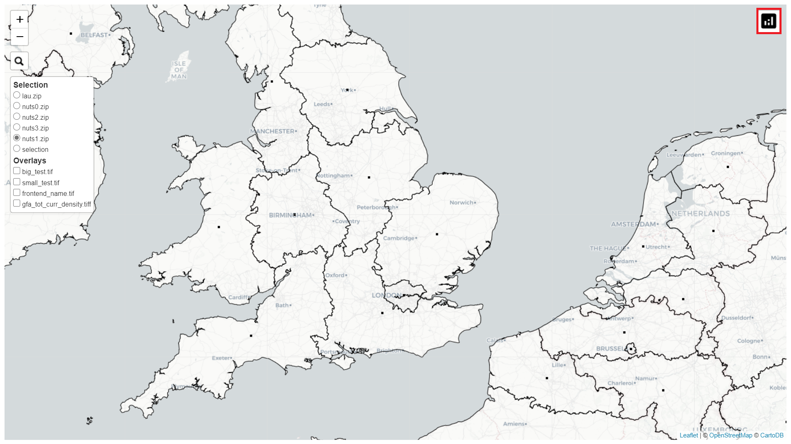
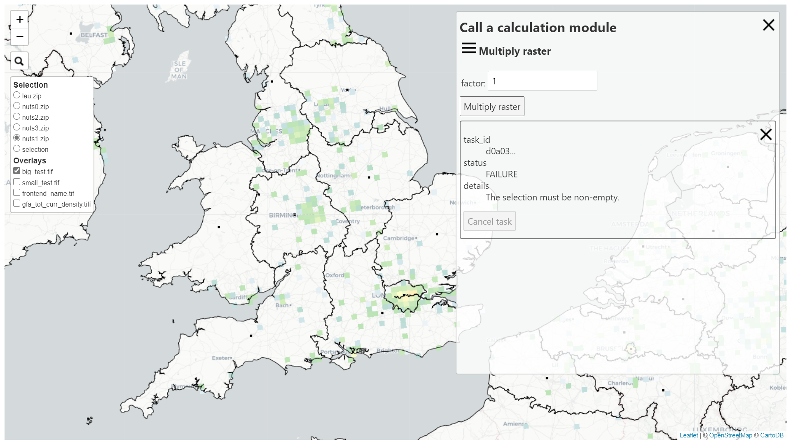
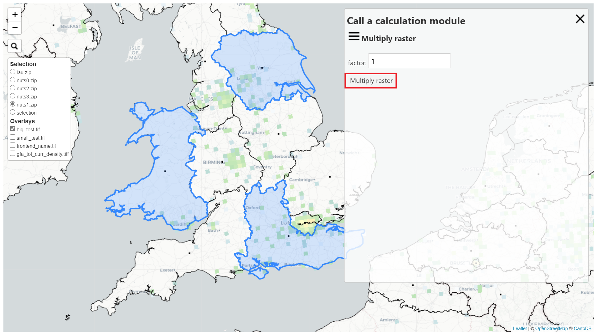

# Preliminary remarks

The *example_multiply* is an example of CM implementation.
It serves as an example for patners developing others CM.

For a non implemented CM, see [*example_empty*](../example_empty) CM.

# Objective

The objective of this CM is to multiply the value of the raster by a factor for a predefined area.

After this multiplication, the CM provides statistical data on the basis of new raster values. 

# How it works 

## Prerequisite

EnerMaps have to be launched.
If this is not yet the case, see [the general README](../../README.md) to find out how to do so.

Once EnerMaps launched, the frontend should be available on this adress : http://127.0.0.1:7000.

## Inputs 

To make the CM work, we need three inputs:

* the raster we want to study,
* the areas we want to study,
* the multiplication factor.

### Raster
To select the raster, we can use the selection tool on the top left of the page.

By default, we have four rasters available to test the CM.

### Areas 
To select the areas, we can use the selection tool on the top left of the page.

An then select the area we want to study :

Several areas can be selected too :

By default, the NUTS 0, NUTS 1, NUTS 2, NUTS 3 and LAU delimitation are available.

### Factor

The multiplication factor is chosen via a drop-down menu.

To access this drop-down menu, select the icon at the top right of the page.

By default, this value is set to 1.

It is necessary to select a raster and an area to be able to launch the CM.

## Run the CM

To start the CM, simply press the launch button.

## Ouputs

As an output, we get the following data :
* the start of the task ID
* the status of the task
* the minimum raster value for the selected zone
* the maximum raster value for the selected zone
* the number of raster elements for the selected area
* the median raster value for the selected zone
* a CDF graph 
 
