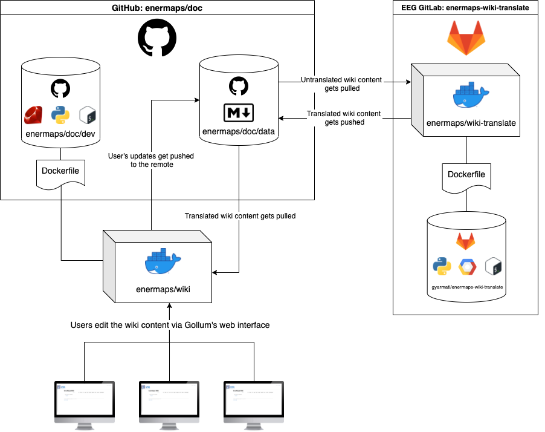

# EnerMaps wiki

[](https://heroku.com/deploy?template=https://github.com/enermaps/enermaps/tree/master/doc)

## Table Of Contents

- [Software architectural Overview](#software-architectural-overview)
- [Running the wiki](#running-the-wiki)
    - [Environment variables overview](#environment-variables-overview)
    - [Build & Run](#build--run)
- [OAuth Configuration](#oauth-configuration)
    - [Setting up OAuth with GitHub](#setting-up-oauth-with-github)
    - [Who can edit the wiki?](#who-can-edit-the-wiki)
- [Automatic remote operations](#automatic-remote-operations)
    - [Container startup](#container-startup)
    - [Authorizing `git` read and write operations inside the container](#authorizing-git-read-and-write-operations-inside-the-container)
    - [Syncing repositories](#syncing-repositories)
- [Develop](#develop)

## Software architectural Overview

This wiki uses [gollum](https://github.com/gollum/gollum) and [omnigollum](https://github.com/arr2036/omnigollum).



## Running the wiki

Kindly create _.env_ file based on _.env.example_ and update the environment variables.

### Environment variables overview

- `GITHUB_CLIENT_ID`: OAuth provider app client ID for GitHub
- `GITHUB_CLIENT_SECRET`: OAuth provider app client secret for GitHub
- `GITHUB_WIKI_REMOTE_URL`: The URL to the repository where the wiki data resides
- `GITHUB_WIKI_REMOTE_BRANCH`: The branch of the repository under `GITHUB_WIKI_REMOTE_URL` to be used

### Build & Run

The building and the running are handled by `docker-compose`. It is favored over `docker build`, since it is more
convenient to specify the environment variables in `docker-compose.yml` using the `.env` file.

```bash
docker-compose build
docker-compose up -d
```

Alternatively, the wiki can be built and started using `docker build` and `docker run` too:

Building an image called `enermaps/wiki` from the `Dockerfile` lying in the current directory `.`:

```shell
docker build -t enermaps/wiki .
```

Running the image `enermaps/wiki` as a container called `wiki` on port `4567` with the required environment variables:

```shell
docker run -d --rm \
-p 4567:80 \
--name enermaps-wiki \
-e GITHUB_CLIENT_ID=0123456789 \
-e GITHUB_CLIENT_SECRET=0123456789 \
-e GITHUB_WIKI_REMOTE_URL=https://<bot personal access token>@github.com/<owner>/<repo name>.git \
-e GITHUB_WIKI_REMOTE_BRANCH=data \
enermaps/wiki
```

## OAuth configuration

To add another provider you should also edit _config.rb_:

```ruby
# ./gollum-data/config.rb

# [...]

options = {
  # OmniAuth::Builder block is passed as a proc
  :providers => Proc.new do

    # GitHub
    provider :github, ENV['GITHUB_CLIENT_ID'], ENV['GITHUB_CLIENT_SECRET']

    # LDAP
    provider :ldap,
             :host => '127.0.0.1',
             :port => 389,
             :method => :plain,
             :base => 'dc=example,dc=com',
             :uid => 'uid',
             :bind_dn => 'cn=manager,dc=example,dc=com',
             :password => 'password'

    # Twitter
    provider :twitter, 'CONSUMER_KEY', 'CONSUMER_SECRET'

    # OpenID
    provider :open_id, OpenID::Store::Filesystem.new('/tmp')

    # others ...

    # [...]
    }
```

Omnigollum allows many OAuth providers. You can find more information about
this [here](https://github.com/arr2036/omnigollum).

### Setting up OAuth with GitHub

For GitHub, you need to create client ID and client secret on GitHub website on the settings page of your account or
organization, in developer settings.

You can read more about how to create an OAuth app on GitHub
in [the official documentation](https://docs.github.com/en/developers/apps/building-oauth-apps/creating-an-oauth-app).

The setting fields should be filled out as follows:

- _Homepage URL_:
    - `<YOUR_URL>`
- _Authorization callback URL_:
    - `<YOUR_URL>/__omnigollum__/auth/github/callback`

To test it in local development, you can take a look at the [Develop](#develop) section.

### Who can edit the wiki?

A GitHub user will be authorized to log in on the wiki platform iff the user is a contributor or a collaborator in the
repository under `GITHUB_WIKI_REMOTE_URL`. The [GitHub API](https://docs.github.com/en/rest) is used to dynamically
determine the identity of these users.

## Automatic remote operations

### Container startup

The `ENTRYPOINT` of the container is `["python3", "/root/docker-run/run.py"]`.

`/root/docker-run/run.py` handles the initial repository setup and starts up the `cron` and `gollum` processes.

The rationale behind using a Python script for the startup is to make it cleaner to handle environment
variable-dependent tasks and conditional operations.

### Authorizing `git` read and write operations inside the container

Users accessing the web interface are authorized directly by GitHub through the `OAuth` app that needs to be set up.
This way, they have repository-wide write permissions. However, an authorization is necessary for the `git` operations
in the background (inside the container) too.

For this purpose a new GitHub account got created, called [enermaps-bot](https://github.com/enermaps-bot). This account
got invited to this repository (`GITHUB_WIKI_REMOTE_URL`) with read & write access. A personal access token got created
for this account to use it for auth on the server-side. The steps of the token creation can be
read [in the official docs](https://docs.github.com/en/authentication/keeping-your-account-and-data-secure/creating-a-personal-access-token)
.

The single place where the value of this token needs to be specified is in the `GITHUB_WIKI_REMOTE_URL` variable. It
needs to be structured as follows: `https://<bot personal access token>@github.com/<owner>/<repo name>.git`.

In the case of our repository, this would be: `https://<bot personal access token>@github.com/enermaps/doc.git`.

### Syncing repositories

#### Pushing changes from the wiki to the remote repository

Editing the wiki on the web interface will trigger `git` diffs in the background. However, these diffs are stored inside
the `git` repository inside the docker container which is deployed, the changes do not get instantly synced to the
repository identified by `GITHUB_WIKI_REMOTE_URL`.

To remedy this, a Python scheduler is spawned inside the deployed Docker container to periodically push all the changes
that were made to the wiki on the web interface.

The shell script `src/scripts/push` gets invoked hourly at `:05` minutes in the background, meaning that all changes to
the wiki will be pushed to the `GITHUB_WIKI_REMOTE_BRANCH` branch of the repo under `GITHUB_WIKI_REMOTE_URL`.

#### Pulling changes from the remote repository to the wiki

Whenever the script for automatic translations gets executed from the machine of a developer, the translated files get
pushed to the remote repository. For these changes to appear on the website of the wiki, the translated files need to be
pulled from the remote.

Similarly to the previous case, a Python process handles this syncing task: the shell script `src/scripts/fetch-pull`
gets invoked hourly at `:00` minutes in the background.

#### Adjusting frequency & Checking logs

To change the frequency of the scripts' invocations under `src/scripts/`, the `src/docker-run/scheduled_jobs.py` file
should be edited. We are using the [schedule](https://github.com/dbader/schedule) Python package to run the jobs
periodically. The definitions are intuitive and human-readable:

```python
schedule.every().hour.at(':00').do(fetch_pull_job)
schedule.every().hour.at(':05').do(push_job)
```

The relevant logs can be checked by running `docker logs -f enermaps-wiki`.

## Develop

When developing locally, before having a deployed instance of the wiki at hand the wiki will be served
on `localhost:4567` by default. However, this does not make it possible to test how GitHub as an authentication provider
works, as on the _OAuth App Settings_ page on GitHub, `localhost` is not a valid URL.

### Localhost Run

The issue can be remedied by tunneling the traffic of `localhost` to the internet,
using [localhost.run](https://localhost.run/), a completely free service.

The following steps should be followed after starting the Docker container:

Start to tunnel traffic from `localhost:4567` (where the containerized wiki is running) to port `80` of some host
managed by `localhost.run`:

```bash
ssh -R 80:localhost:4567 nokey@localhost.run
```

The output will be similar to the following:

```text
===============================================================================
Welcome to localhost.run!

Follow your favourite reverse tunnel at [https://twitter.com/localhost_run].

**You need a SSH key to access this service.**
If you get a permission denied follow Gitlab's most excellent howto:
https://docs.gitlab.com/ee/ssh/
*Only rsa and ed25519 keys are supported*

To set up and manage custom domains go to https://admin.localhost.run/

More details on custom domains (and how to enable subdomains of your custom
domain) at https://localhost.run/docs/custom-domains

To explore using localhost.run visit the documentation site:
https://localhost.run/docs/

===============================================================================


** your connection id is 40883fe3-dba3-4490-9df1-26e3bc342d1e, please mention it if you send me a message about an issue. **

bcd82c4d24aed3.lhr.domains tunneled with tls termination, https://bcd82c4d24aed3.lhr.domains
```

The most important detail from this output message is the domain through which the wiki can be accessed by the
internet: `https://bcd82c4d24aed3.lhr.domains` (`<YOUR_URL>`).

**Be aware, the assigned domains are changed by `localhost.run` frequently. After the domain assigned to your session
has been changed, you need to reconfigure your OAuth app settings on GitHub.**

### Cloudflare

Alternatively, [the tunneling service of Cloudflare](https://developers.cloudflare.com/pages/how-to/preview-with-cloudflare-tunnel)
can be also used throughout local development.

```shell
cloudflared tunnel --url http://localhost:4567
```

Similarly to localhost.run, you see the public tunnel URL:

```text
+--------------------------------------------------------------------------------------------+
|  Your quick Tunnel has been created! Visit it at (it may take some time to be reachable):  |
|  https://suspected-hacker-bouquet-wing.trycloudflare.com                                   |
+--------------------------------------------------------------------------------------------+
```

You can use this to configure your OAuth app on GitHub:

- _Homepage URL_:
    - `<YOUR_URL>`
    - With the localhost.run example: `https://bcd82c4d24aed3.lhr.domains`
    - With the Cloudflare example: `https://suspected-hacker-bouquet-wing.trycloudflare.com`
- _Authorization callback URL_:
    - `<YOUR_URL>/__omnigollum__/auth/github/callback`
    - With the localhost.run example: `https://bcd82c4d24aed3.lhr.domains/__omnigollum__/auth/github/callback`
    - With the Cloudflare
      example: `https://suspected-hacker-bouquet-wing.trycloudflare.com/__omnigollum__/auth/github/callback`

